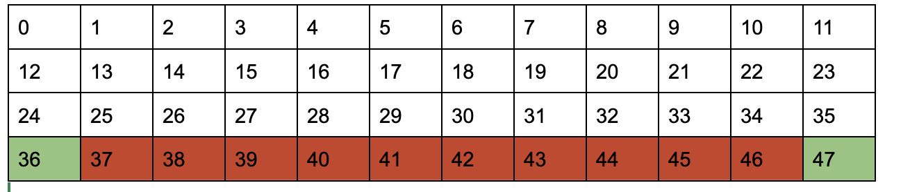
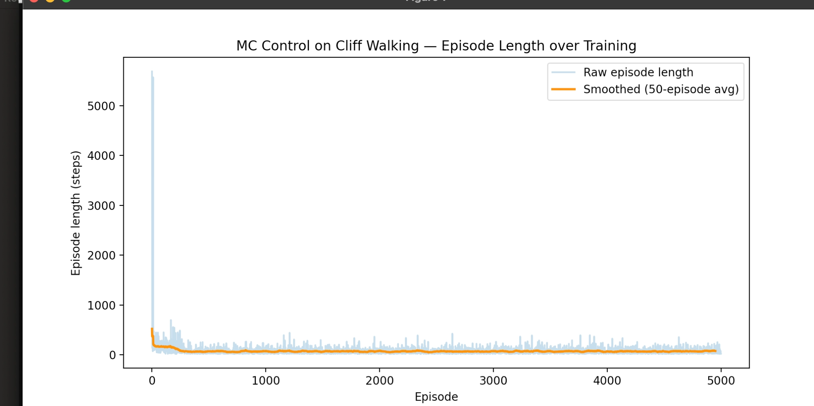

# RL learning notes

## Monte Carlo Control on Cliff Walking

### Overview

The aim here was to build an RL agent that learns to navigate the Cliff Walking environment using the first-visit Monte Carlo control with epsilon greedy exploration.

I used Cliff Walking specifically since it has a solidly clear trade-off between a short risky path (along the cliff) vs a longer safer path , and this is good for observing whether the learned behavior makes sense

Moreover, I want to practice several different tabular RL methods without recreating the scaffolding , so Cliff Walking was a good pick for that as well!

The agent at the end did learn a working policy that reaches it goal terminal state, however there were some hurdles along the way.

## Environment

This is how Cliff Walking is structured:

- The grid is a 4x12 layout, with 48 states in total, labelled 0-47
- The agent starts at state 36 and goal is state 47 as depicted below:
    
    
    
- States 37 to 46, the ones marked red in the figure above, are the cliff. Stepping on even one of them gives a big penalty of -100 to the agent, and resets the agent to the start without ending the episode, and I understood that the episode does not terminate if the agent steps on the cliff by playing around with the environment by hand.
- There are 4 possible discrete actions the agent can take:
    - UP = 0
    - RIGHT = 1
    - DOWN = 2
    - LEFT = 3
- Rewards = -1 per ordinary step, -100 for the cliff, and the episode only truly ends when the goal is reached
- Since every step costs atleast -1, the agent is incentivised to find the shortest path (which is not the cliff of course)

### Method

- I used first-visit monte carlo control here since it learns an optimal policy by using only the first occurance of each state-action pair within an episode to update the Q-table, and averaging these returns over many episodes while gradually shifting the policy towards better actions via epsilon-greedy exploration. However, even if we used every-visit MC, and used it for every occurence of a state-action pair, both first-visit MC and every-visit MC converge to the same answer eventually, but every-visit just uses more samples per episode which arent entirely independent of one another which can complicate some of the theoretical convergence guarantees.
- The Q-table is essentially the agent’s memory of what it learns. We start off by it being initialized to zero since it has not interacted with the environment yet and does not know better.
- Epsilon greedy is essentially how we determine the explore exploit trade-off for the agent. We set how much the agent should explore new outcomes, disregarding what the “best outcome” is supposed to be, and thereby also setting how much it should exploit, or just use the best outcome.  One essential change that I added here was, if the four action value’s are tied, it picks randomly amongst all tied actions , so there’s no hidden bias towards any one of them.
- Monte Carlo needs a full episode before it can learn since it depends on total return, and is not dependent on step by step estimates like some other RL methods which I hope to cover in different posts.
- The update rule is how we update the knowledge of Q-tables and understanding how taking different actions fares for it. The formula for the same is :

<aside>
💡

$$
G_t = R_{t+1} + \gamma R_{t+2} + \gamma^2 R_{t+3} + \gamma^3 R_{t+4} + \dots + \gamma^{T-t-1}R_T
$$

</aside>

- To quickly explain the values here:
    - $G_t$ → The return at time step t. This shows the total accumulated reward from time t onwards until the episode ends. This is what our agent is trying to maximise, not just the immediate reward, but what follows as well.
    - t → time step index within the episode.
    - T→ the final step of the episode, the step at which the episode terminates.
    - $R_{t+1}$ → The reward an agent receives as a consequence of the action it took at time step t
    - γ (gamma)→ The discount factor, a number between 0 and 1. Basically it controls how we weight present rewards compared to future ones. Close to 0 means we just care about present/immediate rewards, and close to 1 means I care about future rewards as much as immediate rewards, i.e no discounting at all.
- in our code since it is a recursive relationship, we just compute it as a simple backward pass

<aside>
💡

G = gamma * G + reward

</aside>

- First-visit rule: only the first occurrence of each (state, action) pair in an episode contributes to that episode's update.
- Now , how do we actually update the Q table?

<aside>
💡

$$
Q(s,a) \leftarrow Q(s,a) + \frac{1}{N(s,a)}\big[G_t - Q(s,a)\big]
$$

</aside>

- Q(s,a) is our current average estimate
- Gt - Q(s,a) is the error, how far away is our current estimate from this new observation
- 1/N(s,a) just reflects how many times we have updated this pair, across every episode ever run, not just this one, so its not a violation for the first-visit MC . This fraction shrinks as N(s,a) grows, and that is what makes each new observation matter less over time and helps us converge to a stable average rather than jumping around.
- After the training, I evaluated the final policy by running the agent greedily, by which I essentially mean always selecting the argmax(Q[state]) with no exploration , starting from state 36 and recording the sequence of states visited until the goal was reached.
- This separates the learning process, which uses the epsilon-greedy process and is inherently noisy , from the evaluation of what was actually learned, which gives a clean test of the final policy’s quality.
- A useful analogy: the update rule is like *studying,* working through practice problems, sometimes deliberately trying an unfamiliar approach just to see what happens (that's the exploration in epsilon-greedy), and revising your notes based on how each attempt went (that's `update_Q` nudging the Q-table toward what actually worked). The greedy evaluation, on the other hand, is like *sitting the final exam. N*o more experimenting, just using everything already learned to give your single best answer to each question. Critically, taking the exam doesn't teach you anything new; it only reveals what you'd already learned. That's the same relationship between `update_Q` and the greedy policy check: one changes what's in the Q-table, the other only reads it.

### Results

- I ran 5000 episodes. As we can see in the figure above, there is a sharp spike in the very first episode, as the completely untrained agent wanders thousands of steps, and then the steps drop within the first 100-200 episodes, settling into a new stable lower band, of roughly 20-100 steps for the rest of training
- From episode 500 onwards as we can see, the smoothed curve is essentially flat, that means most of the real learning ended up happening early
- The unsmoothed line however, stays noisy even later. This is because we use a fixed epsilon of 0.1 so the agent keeps taking random actions a fixed fraction (10% here) for the entire time, causing longer episodes even once the policy has converged.
- The final learned policy looks like:

<aside>
💡

[36, 24, 12, 13, 14, 26, 27, 15, 16, 4, 5, 6, 7, 19, 31, 32, 33, 34, 35, 47]

</aside>

- This is a complete 19 step route that starts from 36 and ends at the terminal state 47 with no repeated states and no steps on the cliff, which means the agent learned to avoid high penalty cliff squares while finding a reasonably short path to the goal

### Debugging

- With an all-zero Q-table , np.argmax always returned the same action (index 0) whenever values were tied , even though with “exploit” its supposed to mean pick the best, but with everything tied at 0, every action was equally best
- Due to this, the agent developed a hidden bias towards picking UP early in training (possibly cause its the first action ) getting stuck bouncing against the top wall for several steps in a single episode
- The fix was to replace argmax with an explicit tie breaker. Now what my code does, is it finds all actions tied for the max value, and then chooses randomly amongst those!

### Limitations/Future work

- If I recreate this, I would implement epsilon decay. I would essentially gradually lower epsilon over training so the policy stabilizes later on to make convergence more reliable